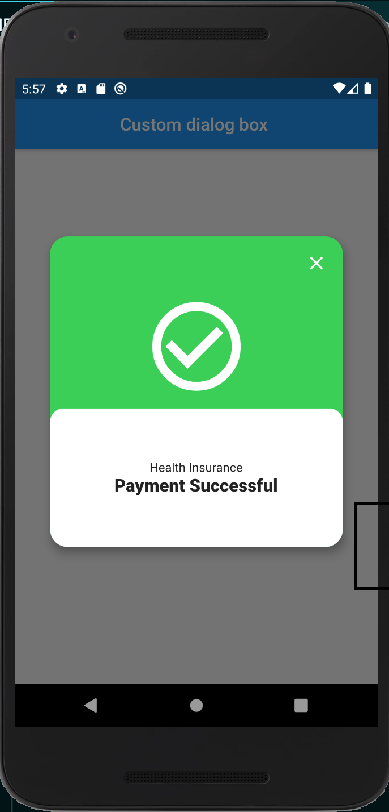
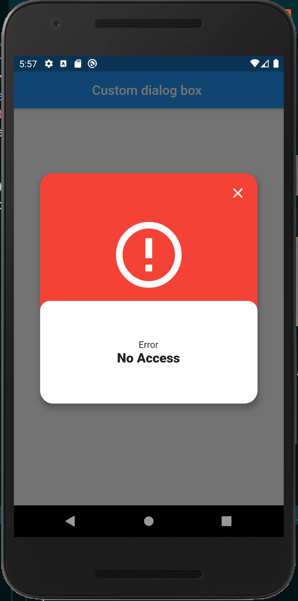

A fully custom alert and dialog box showing messages after a form submit.
This widget can be used in form submit, login and payment forms.

<b>Usage in a raised button on press</b>

            RaisedButton(
                    onPressed: () {
                        showDialog(
                        context: context,
                        builder: (context) => CustomDialog(
                            content: Text(
                            'Payment Successful',
                            style: TextStyle(
                                fontWeight: FontWeight.w900,
                                fontSize: 20.0,
                            ),
                            ),
                            title: Text('Health Insurance'),
                            firstColor: Color(0xFF3CCF57),
                            secondColor: Colors.white,
                            headerIcon: Icon(
                            Icons.check_circle_outline,
                            size: 120.0,
                            color: Colors.white,
                            ),
                        ),
                        );
                    },
                    child: Text('Press'),
                    )
